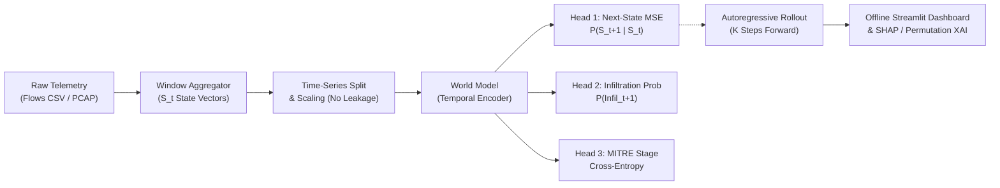

# NetForecast: AI-based Network Attack Forecasting World Model

[](LICENSE)
[](https://www.python.org/)
[]()
[]()

> **Smart India Hackathon 2026**  
> **Problem Statement SIH26153**: *AI based Network Attack Forecasting from Network Traffic Data*  
> **Developed by**: Team CHECK_MATE  

---

## 📌 Overview

Traditional Network Intrusion Detection Systems (NIDS) are static classifiers that flag attacks *after* they happen on individual flows.

**NetForecast** is an open-source, offline **Predictive Network Dynamics World Model** that:
1. **Models Network State Transitions**: Learns temporal transition dynamics $P(S_{t+1} \mid S_t, \dots, S_{t-W})$ over time-window state vectors $S_t$.
2. **Autoregressive K-Step Forecasting**: Rolls forward $K$ steps to predict future attack probability trajectories before breaches occur.
3. **MITRE ATT&CK Mapping**: Maps predicted behavioral changes across enterprise attack progression stages (Initial Access, Lateral Movement, C2, Impact).
4. **Explainable AI**: Provides SHAP and Permutation Feature Importance to reveal root-cause network indicators.
5. **Offline Streamlit UI**: Operates completely offline with support for CSV and PCAP uploads.

---

## 🏛️ System Architecture



For detailed mathematical formulations and sequence diagrams, refer to [docs/ARCHITECTURE.md](docs/ARCHITECTURE.md).

---

## 📁 Repository Structure

```
netforecast/
├── .gitignore
├── LICENSE
├── README.md
├── config.yaml                     # Model hyperparams, window sizes, MITRE taxonomy
├── requirements.txt                # Pinned dependencies
├── app/
│   └── streamlit_app.py            # Offline Streamlit UI & interactive dashboard
├── docs/
│   └── ARCHITECTURE.md             # 2-page system architecture & dynamics specs
├── results/
│   ├── metrics.json                # Auto-generated empirical metrics
│   ├── metrics.md                  # Auto-generated metrics markdown table
│   └── plots/                      # ROC curves, confusion matrices
├── scripts/
│   └── download_data.sh            # CIC-IDS-2018 download script
├── src/
│   └── netforecast/
│       ├── __init__.py
│       ├── attack/
│       │   ├── __init__.py
│       │   └── mitre_map.py        # Label to MITRE ATT&CK stage mapper
│       ├── data/
│       │   ├── __init__.py
│       │   ├── load_csv.py         # CIC-IDS-2018 loader, cleaner, synthetic generator
│       │   └── pcap_features.py    # Scapy packet-level feature extractor
│       ├── explain/
│       │   ├── __init__.py
│       │   └── shap_explain.py     # SHAP & Permutation feature attributions
│       ├── features/
│       │   ├── __init__.py
│       │   └── windows.py          # Time-window aggregation & dataset builder
│       ├── models/
│       │   ├── __init__.py
│       │   ├── baseline.py         # Logistic Regression K-step baseline
│       │   ├── rollout.py          # Autoregressive forward simulator
│       │   └── world_model.py      # PyTorch multi-task LSTM World Model
│       ├── train.py                # Model training pipeline
│       └── evaluate.py             # Evaluation, holdout tests & metrics generator
└── tests/
    ├── test_loader.py              # CSV cleaning & synthetic generator tests
    ├── test_pcap.py                # Scapy PCAP extraction tests
    ├── test_rollout.py             # World Model & rollout shape tests
    └── test_windows.py             # Windowing & scaling leakage tests
```

---

## 🚀 Setup & Installation

### 1. Clone Repository & Setup Virtual Environment
```bash
git clone https://github.com/Youtubewalabhai/netforecast-sih26153.git
cd netforecast
python -m venv venv
# On Windows:
venv\Scripts\activate
# On Linux/macOS:
source venv/bin/activate
```

### 2. Install Dependencies
```bash
pip install -r requirements.txt
pip install -e src/
```

---

## 📊 Dataset Ingestion (CIC-IDS-2018)

Download the selected CIC-IDS-2018 CSV subset into `data/raw/`:

```bash
# Automated via AWS CLI:
bash scripts/download_data.sh

# Or manually download:
# 1. 02-14-2018.csv (FTP-BruteForce / SSH-Bruteforce)
# 2. 02-15-2018.csv (DoS-GoldenEye / DoS-Slowloris)
# 3. 02-28-2018.csv (Infiltration)
# Place them inside: netforecast/data/raw/
```

---

## 🏋️ Training & Evaluation

### Training
```bash
# Train on CIC-IDS-2018 dataset (CPU run time: ~5-10 minutes):
python -m netforecast.train --config config.yaml

# For quick smoke-testing with synthetic data (labelled clearly):
python -m netforecast.train --config config.yaml --synthetic
```

### Evaluation & Metrics Generation
```bash
# Evaluates World Model vs Baseline, generates ROC/Confusion matrices, and writes results/metrics.md:
python -m netforecast.evaluate --config config.yaml
```

---

## 🖥️ Running the Offline Streamlit Dashboard

Launch the offline dashboard:
```bash
streamlit run app/streamlit_app.py
```

Features included:
- **Interactive Telemetry Upload**: Drag-and-drop CSV or PCAP captures.
- **Demo Mode**: Instant walkthrough with pre-configured attack sequences.
- **Forward Horizon Slider**: Adjust K-step forward simulation (t+1 to t+10).
- **MITRE Stage Indicators**: Real-time MITRE ATT&CK tactic alerts.
- **Explainability Panel**: Live feature importance attributions.

---

## 🧪 Running Unit Tests

Run full test suite:
```bash
pytest -v tests/
```

---

## ⚠️ Limitations & Strict Honesty Notes

1. **Packet vs Flow Features**: CIC-IDS-2018 CSVs only contain flow-level statistics. Raw packet headers (TTL variance, TCP window size, IP fragmentation) are engineered when `.pcap` files are parsed via `src/netforecast/data/pcap_features.py`.
2. **MITRE Stage Assumption**: Dataset ground-truth attack labels are mapped to MITRE ATT&CK stages via the declarative taxonomy in `config.yaml`.
3. **Offline Scope**: NetForecast executes 100% locally on standard CPU hardware without cloud API dependencies.
4. **Metrics Integrity**: All evaluation metrics in `results/metrics.json` and `results/metrics.md` are generated directly from execution runs.

---

## 📜 License

This project is licensed under the MIT License — see the [LICENSE](LICENSE) file for details.
