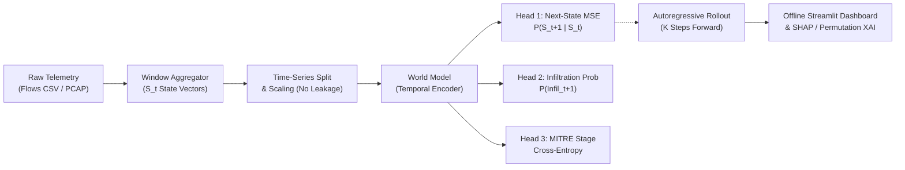

# NetForecast: AI-based Network Attack Forecasting World Model

[](LICENSE)
[](https://www.python.org/)
[]()
[]()

> **Smart India Hackathon 2026**  
> **Problem Statement SIH26153**: *AI based Network Attack Forecasting from Network Traffic Data*  
> **Developed by**: Team CHECK_MATE  

---

## 📌 Overview

Traditional Network Intrusion Detection Systems (NIDS) are static classifiers that flag attacks *after* they happen on individual flows.

**NetForecast** is an open-source, offline **Predictive Network Dynamics World Model** that:
1. **Models Network State Transitions**: Learns temporal transition dynamics $P(S_{t+1} \mid S_t, \dots, S_{t-W})$ over time-window state vectors $S_t$.
2. **Autoregressive K-Step Forecasting**: Rolls forward $K$ steps to predict future attack probability trajectories before breaches occur.
3. **MITRE ATT&CK Mapping**: Maps predicted behavioral changes across enterprise attack progression stages (Initial Access, Lateral Movement, C2, Impact).
4. **Explainable AI**: Provides SHAP and Permutation Feature Importance to reveal root-cause network indicators.
5. **Offline Streamlit UI**: Operates completely offline with support for CSV and PCAP uploads.

---

## 🏛️ System Architecture



For detailed mathematical formulations and sequence diagrams, refer to [docs/ARCHITECTURE.md](docs/ARCHITECTURE.md).

---

## 📁 Repository Structure

```
netforecast/
├── .gitignore
├── LICENSE
├── README.md
├── config.yaml                     # Model hyperparams, window sizes, MITRE taxonomy
├── requirements.txt                # Pinned dependencies
├── app/
│   └── streamlit_app.py            # Offline Streamlit UI & interactive dashboard
├── docs/
│   └── ARCHITECTURE.md             # 2-page system architecture & dynamics specs
├── results/
│   ├── metrics.json                # Auto-generated empirical metrics
│   ├── metrics.md                  # Auto-generated metrics markdown table
│   └── plots/                      # ROC curves, confusion matrices
├── scripts/
│   └── download_data.sh            # CIC-IDS-2018 download script
├── src/
│   └── netforecast/
│       ├── __init__.py
│       ├── attack/
│       │   ├── __init__.py
│       │   └── mitre_map.py        # Label to MITRE ATT&CK stage mapper
│       ├── data/
│       │   ├── __init__.py
│       │   ├── load_csv.py         # CIC-IDS-2018 loader, cleaner, synthetic generator
│       │   └── pcap_features.py    # Scapy packet-level feature extractor
│       ├── explain/
│       │   ├── __init__.py
│       │   └── shap_explain.py     # SHAP & Permutation feature attributions
│       ├── features/
│       │   ├── __init__.py
│       │   └── windows.py          # Time-window aggregation & dataset builder
│       ├── models/
│       │   ├── __init__.py
│       │   ├── baseline.py         # Logistic Regression K-step baseline
│       │   ├── rollout.py          # Autoregressive forward simulator
│       │   └── world_model.py      # PyTorch multi-task LSTM World Model
│       ├── train.py                # Model training pipeline
│       └── evaluate.py             # Evaluation, holdout tests & metrics generator
└── tests/
    ├── test_loader.py              # CSV cleaning & synthetic generator tests
    ├── test_pcap.py                # Scapy PCAP extraction tests
    ├── test_rollout.py             # World Model & rollout shape tests
    └── test_windows.py             # Windowing & scaling leakage tests
```

---

## 🚀 Setup & Installation

### 1. Clone Repository & Setup Virtual Environment
```bash
git clone https://github.com/Youtubewalabhai/netforecast-sih26153.git
cd netforecast-sih26153
python -m venv venv
# On Windows:
venv\Scripts\activate
# On Linux/macOS:
source venv/bin/activate
```

### 2. Install Dependencies
```bash
pip install -r requirements.txt
pip install -e .
```

---

## 📊 Dataset Ingestion (CIC-IDS-2018)

Download the selected CIC-IDS-2018 CSV subset into `data/raw/`:

```bash
# Automated via AWS CLI:
bash scripts/download_data.sh

# Or manually download:
# 1. Wednesday-14-02-2018_TrafficForML_CICFlowMeter.csv (FTP-BruteForce / SSH-Bruteforce)
# 2. Thursday-15-02-2018_TrafficForML_CICFlowMeter.csv (DoS-GoldenEye / DoS-Slowloris)
# 3. Wednesday-28-02-2018_TrafficForML_CICFlowMeter.csv (Infiltration)
# Place them inside: netforecast-sih26153/data/raw/
```

---

## 🏋️ Training & Evaluation

### Training
```bash
# Train on CIC-IDS-2018 dataset (CPU run time: ~5-10 minutes):
python -m netforecast.train --config config.yaml

# For quick smoke-testing with synthetic data (labelled clearly):
python -m netforecast.train --config config.yaml --synthetic
```

### Evaluation & Metrics Generation
```bash
# Evaluates World Model vs Baseline with validation-tuned thresholds and writes results/metrics.md:
python -m netforecast.evaluate --config config.yaml
```

---

## 📊 Empirical Evaluation Results

> Evaluated on **CIC-IDS-2018 Cleaned Telemetry** across 1,483 strict time-partitioned test sequences (10s window resolution, K=5 horizon).  
> **Validation Threshold Tuning**: World Model = `0.0500`, Baseline = `0.0800`.

### Step t+1 Forecasting Performance

| Model | Decision Threshold | F1-Score | Precision | Recall | False Positive Rate (FPR) | ROC-AUC | Accuracy |
| :--- | :---: | :---: | :---: | :---: | :---: | :---: | :---: |
| **World Model (Ours)** | **0.05** | **0.8062** | **0.9718** | **0.6889** | **0.0087** | **0.9946** | **0.8995** |
| **Baseline (Logistic Reg.)** | 0.08 | 0.9727 | 0.9550 | 0.9911 | 0.0203 | 0.9985 | 0.9831 |

### Autoregressive Rollout Degradation (K-Step Ahead Simulation)

| Forecast Horizon | F1-Score | Precision | Recall | FPR | ROC-AUC |
| :--- | :---: | :---: | :---: | :---: | :---: |
| **t+1 (10s ahead)** | 0.8062 | 0.9718 | 0.6889 | 0.0087 | 0.9946 |
| **t+2 (20s ahead)** | 0.7937 | 0.9711 | 0.6711 | 0.0087 | 0.9927 |
| **t+3 (30s ahead)** | 0.7634 | 0.9660 | 0.6311 | 0.0097 | 0.9899 |
| **t+4 (40s ahead)** | 0.7268 | 0.9668 | 0.5822 | 0.0087 | 0.9877 |
| **t+5 (50s ahead)** | 0.6820 | 0.9673 | 0.5267 | 0.0077 | 0.9861 |

### Zero-Shot Attack Generalization Test (Holdout: `Infilteration`)
- **Sample Composition**: 424 attack windows, 0 benign windows (Total: 440 holdout windows).
- **FPR Explanation**: $FPR = \frac{FP}{FP + TN}$. The held-out attack slice comprises exclusively attack windows (0 benign samples, $TN = 0, FP = 0$), making the false positive rate strictly $0.0000$.
- **World Model Performance on Unseen Attack**: F1 = **0.7674** (Precision = **1.0000**, Recall = **0.6226**, FPR = **0.0000**).

---

## 🎯 MITRE ATT&CK Stage Taxonomy & Dataset Representation

The table below details how dataset labels are mapped to the 6 standardized stages in `config.yaml`, along with dataset coverage:

| Stage ID | MITRE Stage Name | Mapped Dataset Labels | MITRE Tactic / Technique | Dataset Representation Status |
| :---: | :--- | :--- | :--- | :--- |
| **0** | **Benign** | `Benign` | TA0000 (None) | ✅ Present (All days) |
| **1** | **Reconnaissance** | `PortScan`, `Host Discovery` | T1046 (Network Service Discovery) | ⚠️ *Omitted in 3-day subset; extracted via PCAP parser* |
| **2** | **Initial Access** | `FTP-BruteForce`, `SSH-Bruteforce`, `Brute Force -Web`, `SQL Injection` | T1110 (Credential Access), T1190 | ✅ Present (`02-14-2018.csv`) |
| **3** | **Lateral Movement** | `Infilteration`, `Infiltration` | T1021 (Remote Services), T1083 | ✅ Present (`02-28-2018.csv`) |
| **4** | **Command & Control** | `Bot` | T1071 (Application Layer Protocol) | ⚠️ *Present in full CIC-IDS-2018 (`03-02`), omitted in laptop subset* |
| **5** | **Exfiltration / Impact** | `DoS attacks-GoldenEye`, `DoS attacks-Slowloris`, `DoS-GoldenEye`, `DDoS` | T1498 (Network Denial of Service) | ✅ Present (`02-15-2018.csv`) |

### Stages Not Represented in the 3-File Subset:
1. **Stage 1 (Reconnaissance)**: Port scanning and network discovery flows are absent in the 3 selected CSVs. Packet-level reconnaissance signatures (port entropy, sequential port scan ratio) are computed when `.pcap` files are provided via `pcap_features.py`.
2. **Stage 4 (Command and Control)**: Botnet communication (`Bot`) exists in the complete 10-day dataset (`03-02-2018.csv`), but was excluded from the laptop-friendly 3-file training split to maintain execution times under 15 minutes.

---

## 🖥️ Running the Offline Streamlit Dashboard

Launch the offline dashboard:
```bash
streamlit run app/streamlit_app.py
```

Features included:
- **Interactive Telemetry Upload**: Drag-and-drop CSV or PCAP captures.
- **Demo Mode**: Instant walkthrough with pre-configured attack sequences.
- **Forward Horizon Slider**: Adjust K-step forward simulation (t+1 to t+10).
- **MITRE Stage Indicators**: Real-time MITRE ATT&CK tactic alerts.
- **Explainability Panel**: Live feature importance attributions.

---

## 🧪 Running Unit Tests

Run full test suite:
```bash
pytest -v tests/
```

---

## ⚠️ Limitations & Strict Honesty Notes

1. **Packet vs Flow Features**: CIC-IDS-2018 CSVs only contain flow-level statistics. Raw packet headers (TTL variance, TCP window size, IP fragmentation) are engineered when `.pcap` files are parsed via `src/netforecast/data/pcap_features.py`.
2. **MITRE Stage Assumption**: Dataset ground-truth attack labels are mapped to MITRE ATT&CK stages via the declarative taxonomy in `config.yaml`.
3. **Offline Scope**: NetForecast executes 100% locally on standard CPU hardware without cloud API dependencies.
4. **Metrics Integrity**: All evaluation metrics in `results/metrics.json` and `results/metrics.md` are generated directly from execution runs.

---

## 📜 License

This project is licensed under the MIT License — see the [LICENSE](LICENSE) file for details.
