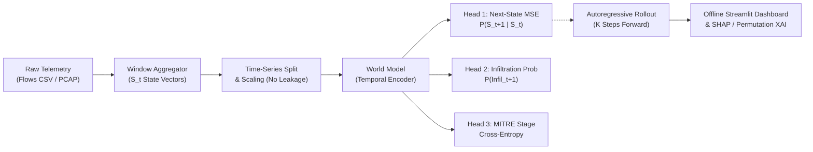
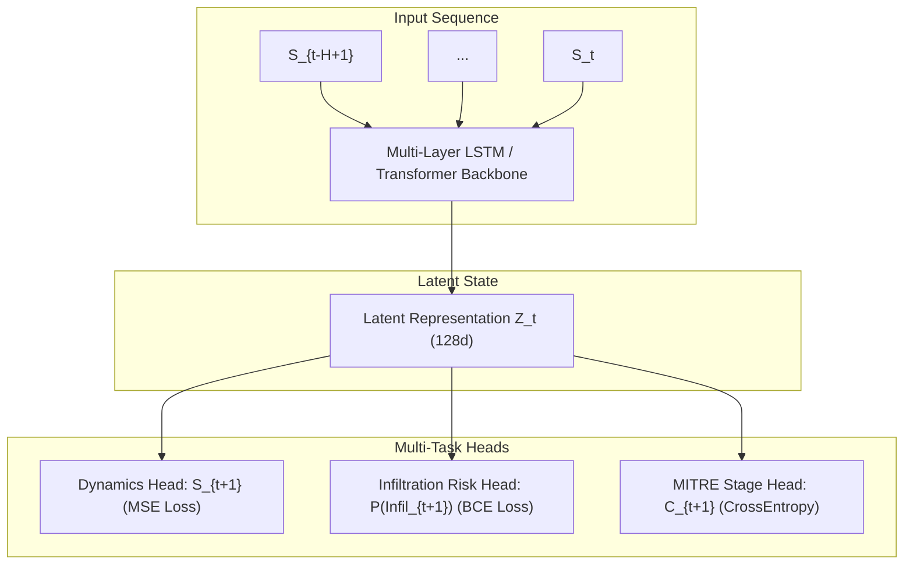

# NetForecast System Architecture

> **Problem Statement**: SIH26153 — AI-based Network Attack Forecasting from Network Traffic Data  
> **Team**: CHECK_MATE | Smart India Hackathon 2026

---

## 1. Executive Summary & Philosophy

Traditional Network Intrusion Detection Systems (NIDS) are **static per-flow classifiers**: given a flow $f$, they predict $P(\text{attack} \mid f)$ post-facto. 

**NetForecast** introduces a **Predictive Network Dynamics World Model**. Rather than classifying isolated packets, it:
1. Discretizes network telemetry into temporal state vectors $S_t \in \mathbb{R}^D$ over time windows $W$.
2. Learns the underlying transition dynamics $P(S_{t+1} \mid S_t, S_{t-1}, \dots, S_{t-H})$.
3. Rolls the model forward autoregressively for $K$ steps to predict future state trajectories $\hat{S}_{t+1}, \dots, \hat{S}_{t+K}$.
4. Forecasts infiltration risk probabilities $P(\text{Infiltration}_{t+k})$ and maps evolving behavioral signatures to **MITRE ATT&CK Enterprise Matrix** stages.

---

## 2. Telemetry Processing & Feature Representation

### 2.1 Multi-Layer Telemetry Ingestion
- **Flow-Level Telemetry (CIC-IDS-2018 CSV)**: Inter-arrival times (IAT mean/std/max), forward/backward packet counts and byte volumes, TCP flags (SYN, FIN, RST, PSH, ACK, URG), active/idle windows, and header lengths.
- **Packet-Level Telemetry (PCAP / Scapy)**: Session TTL variance, TCP receive window dynamics, IP fragmentation flags, payload length distributions, and port entropy / scan signatures.
- *Honest Note*: CIC-IDS-2018 processed CSVs lack raw packet headers (e.g. TTL, IP frag). When raw PCAPs are supplied, deep packet features are parsed via Scapy; when CSVs are provided, flow statistical moments form the state representation.

### 2.2 Time-Window State Construction ($S_t$)
Flows occurring within window $[t \cdot \Delta, (t+1) \cdot \Delta)$ (default $\Delta = 10\text{s}$) are aggregated into statistical moments (mean, standard deviation, max) to form state vector $S_t \in \mathbb{R}^{72}$.

---

## 3. World Model Architecture & Multi-Task Objective

### 3.1 Loss Formulation
The network is trained with a joint multi-task objective:
$$\mathcal{L}_{\text{total}} = \lambda_{\text{dyn}} \mathcal{L}_{\text{MSE}}(\hat{S}_{t+1}, S_{t+1}) + \lambda_{\text{inf}} \mathcal{L}_{\text{BCE}}(\hat{p}_{t+1}, y^{\text{inf}}_{t+1}) + \lambda_{\text{stage}} \mathcal{L}_{\text{CE}}(\hat{c}_{t+1}, y^{\text{stage}}_{t+1})$$

Where defaults are $\lambda_{\text{dyn}} = 1.0, \lambda_{\text{inf}} = 2.0, \lambda_{\text{stage}} = 1.5$.

---

## 4. Autoregressive K-Step Forward Rollout

For predictive forecasting $K$ windows into the future:
1. Feed history sequence $\mathbf{X}^{(0)} = [S_{t-H+1}, \dots, S_t]$ to the model to obtain $\hat{S}_{t+1}, \hat{p}_{t+1}, \hat{c}_{t+1}$.
2. Update the input sequence autoregressively:
   $$\mathbf{X}^{(1)} = [S_{t-H+2}, \dots, S_t, \hat{S}_{t+1}]$$
3. Iterate for $k = 1, \dots, K$ to generate the full threat trajectory:
   $$\mathcal{T} = \left\{ (\hat{p}_{t+k}, \hat{c}_{t+k}, \hat{S}_{t+k}) \right\}_{k=1}^K$$

---

## 5. MITRE ATT&CK Mapping & Assumptions

Ground truth stages are translated via explicit taxonomy mappings:

| Dataset Label | Stage ID | MITRE ATT&CK Stage | Enterprise Tactic ID | Infiltration Flag |
| :--- | :---: | :--- | :--- | :---: |
| **Benign** | 0 | Benign | TA0000 | 0 |
| **FTP-BruteForce / SSH-Bruteforce** | 2 | Initial Access | T1110 (Credential Access) | 1 |
| **Infiltration** | 3 | Lateral Movement | T1021 / T1083 | 1 |
| **Bot** | 4 | Command and Control | T1071 | 1 |
| **DoS / DDoS** | 5 | Exfiltration / Impact | T1498 (Denial of Service) | 0 |

*Assumption Documentation*: Label transitions across time windows represent sequential attacker progression under the MITRE framework.

---

## 6. Explainability & Offline Operation

1. **SHAP KernelExplainer**: Computes Shapley values across flattened temporal sequences, aggregated to rank driving network metrics.
2. **Permutation Importance Fallback**: Permutes individual feature channels with Gaussian noise to quantify marginal risk shifts when SHAP execution exceeds time limits.
3. **Completely Offline**: Zero external network requests at inference time. Streamlit UI and inference pipelines execute locally on standard laptop CPUs.
